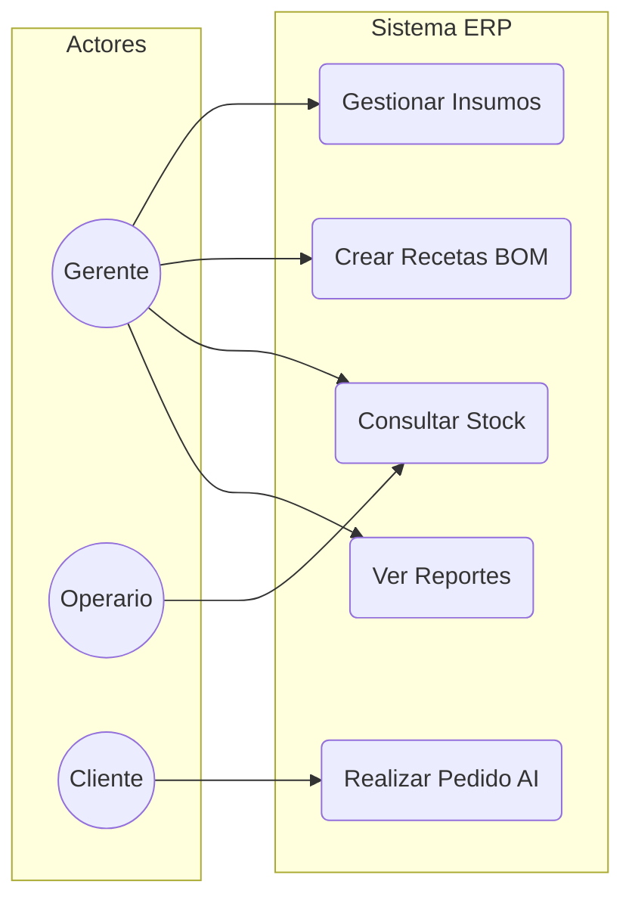
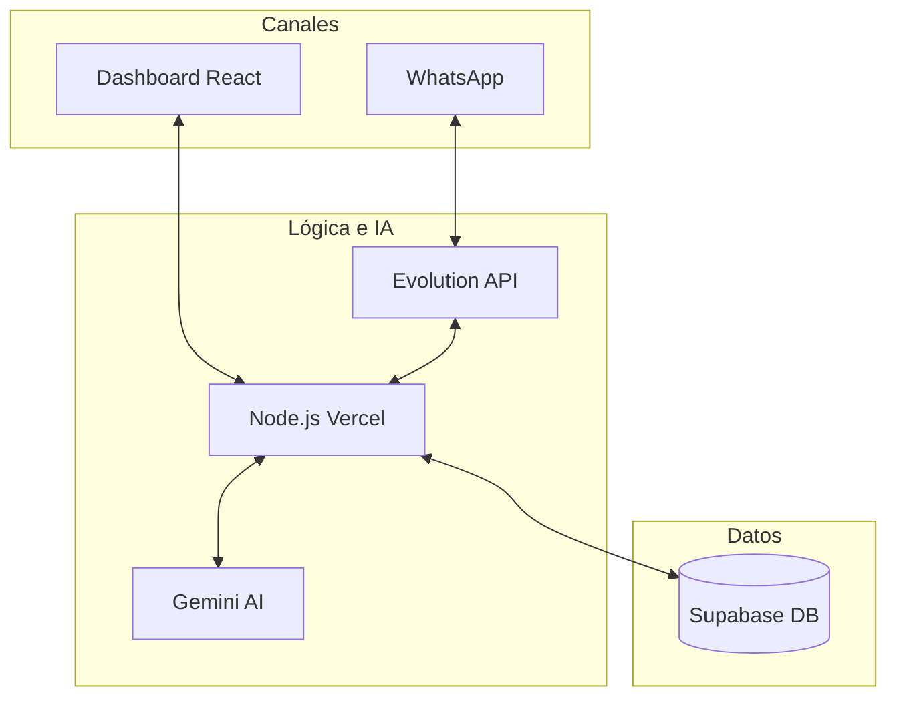

# Diagramas Técnicos: Fase de Inicio (ERP Emssa Valems)

Este documento contiene los gráficos técnicos sugeridos para el Capítulo 4 de la documentación del proyecto de innovación.

## 1. Diagrama de Casos de Uso (Funcionalidad por Roles)

Este diagrama visualiza cómo interactúan los diferentes actores con el sistema omnicanal.

---

## 2. Diagrama de Arquitectura Conceptual (Ecosistema Tecnológico)

Muestra el flujo de datos entre la Inteligencia Artificial, la Base de Datos y la Interfaz Web.

